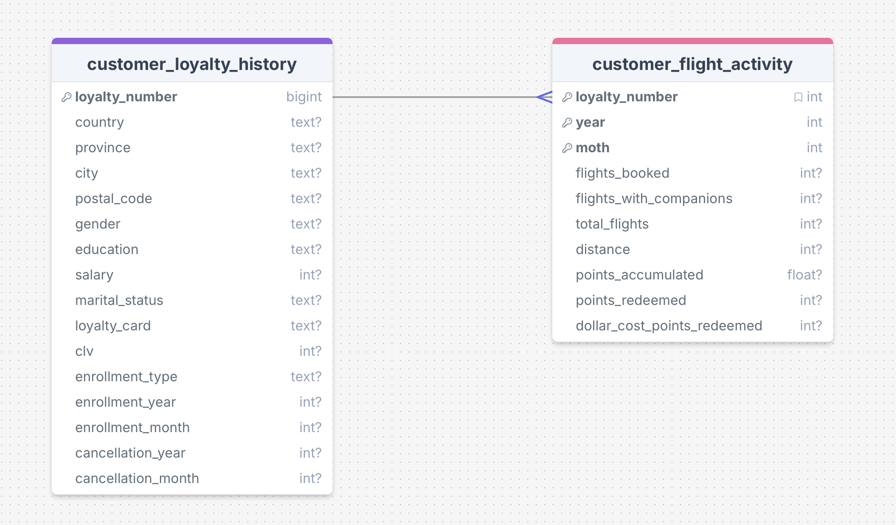
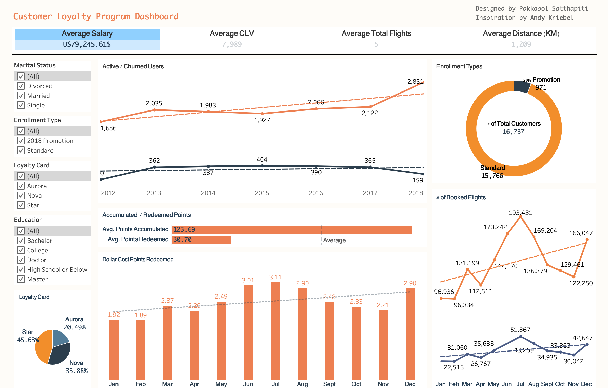
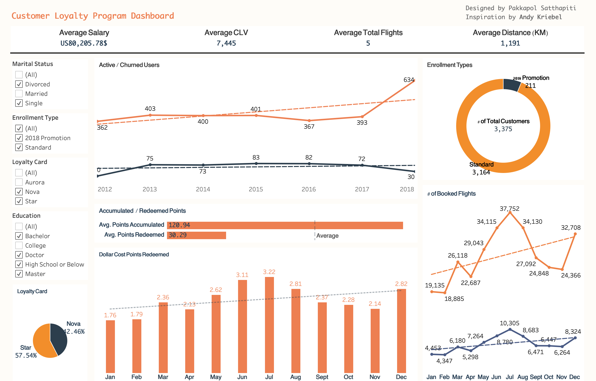

# Customer Loyalty Program Analysis

## Goal
This project aims to provide a comprehensive analysis of a customer loyalty program. The primary goal is to uncover actionable insights into customer behavior, loyalty program effectiveness, and churn drivers. By answering key business questions, this project delivers a data-driven foundation for optimizing marketing strategies, improving customer retention, and enhancing the overall value of the loyalty program.

---

## Background

Customer loyalty programs are central to the airline industry’s customer retention and revenue strategy. Understanding how customers interact with loyalty tiers, accumulate and redeem points, and respond to promotions can unlock opportunities for personalized offers and better service design.
This project analyzes a comprehensive dataset containing customer loyalty history and flight activity records. It covers over 100,000 customer profiles and detailed monthly flight behavior, spanning multiple years. The project explores:

- Differences in behavior across loyalty card tiers (Aurora, Nova, Star)
- Relationships between salary, CLV, and point usage
- Demographic influences such as education, marital status, and gender
- Seasonal flight trends and companion travel patterns
- Impact of promotional enrollments on churn and engagement
- Behavioral segmentation for identifying upsell opportunities

By answering these well-defined business questions, the analysis provides actionable insights into what makes customers stay loyal—or leave—and how their socioeconomic traits relate to flying and spending habits.

## Insights Summary

### Salary and Points Accumulation
- Customers with higher salaries tend to accumulate more points, especially in the top 25% salary bracket.
- There is a clear upward trend in points accumulated as salary increases, suggesting loyalty rewards correlate with higher spending power.
- Customers in the highest salary quantile contribute the most to points accumulation, indicating high-value targets for premium loyalty programs.

### Points Redemption Behavior
- Customers with mid to high salary levels tend to redeem points more actively than lower salary segments.
- Lower-income customers redeem fewer points, possibly due to less travel frequency or lack of awareness about redemption opportunities.
- Redemption behavior is more common among Star loyalty card holders, regardless of salary level.

### Card Type and Customer Value
- Star loyalty card holders have higher CLV and accumulate more points on average compared to Aurora card holders.
- Aurora card holders tend to have lower engagement in terms of flight bookings and points redemption.
- The majority of high-CLV customers are concentrated among Star card holders, suggesting higher loyalty program effectiveness.
 
### Geographic and Demographic Trends
- Most high-spending and high-value customers are concentrated in urban cities like Montreal, Toronto, and Vancouver.
- Male customers slightly outnumber female customers in the high CLV group, though both genders are evenly distributed across loyalty card types.
- Customers with Bachelor degrees dominate both Aurora and Star segments, making up the largest education group.

---

## Recommendations

### Personalise Loyalty Offers by Salary Segment
- Since higher salary segments show more accumulation and redemption activity, consider offering tiered loyalty incentives based on customer income brackets. Example: High-income customers could be targeted with exclusive travel deals or VIP perks, while mid/lower-income groups might respond better to cashback or discount-based incentives.

### Identify At-Risk Segments from Cancellation Data
- Use patterns from Cancellation Year and Cancellation Month along with lower CLV scores to create churn prediction models.
Target these at-risk customers with retention campaigns such as limited-time bonuses or reminders of unused points.

### Enhance Engagement in Low-Salary Quantiles
- Customers in lower salary quartiles accumulate fewer points. Introduce engagement-based point systems (e.g. surveys, app check-ins) to keep them involved even if they spend less. This helps broaden the base of loyal users without relying solely on high spenders.

### Reward Longevity and Enrollment Patterns
- Customers who enrolled earlier tend to show higher CLV and lower cancellation rates. Encourage newer users to stay engaged with milestone-based incentives (e.g. "1-year loyalty badge", surprise point boosts).

---

## Challenges Faced & Solutions

- During the data ingestion from CSV to PostgreSQL, several key challenges were overcome. Initial attempts encountered integer out of range errors, which required careful refinement of the database schema to handle large numerical values.

- A more complex issue was a subtle incompatibility between pandas' pd.NA null representation and the psycopg2 driver. This problem, which manifested as a can't adapt type 'NAType' error, was resolved by explicitly converting all null values to None before insertion. This was a critical step for data integrity.

- Finally, to optimize the process, a slow row-by-row insertion loop was replaced with a more efficient bulk insertion method (execute_batch). This ensured not only the correctness of the data but also the scalability of the loading pipeline.

---

## Data Structure

The dataset contained two tables, including information about customer demogramphics, and customer flight activity.

---
## Dashboard Summary

This dashboard provides a comprehensive visual analysis of customer loyalty program data, translating complex SQL queries into an interactive and user-friendly interface. It is designed to empower stakeholders with actionable insights into customer behavior, and loyalty programme effectiveness.

Click [here](https://public.tableau.com/views/Loyalty_programme/Dashboard1?:language=en-GB&:sid=&:redirect=auth&:display_count=n&:origin=viz_share_link) to view the interactive dashboard.

Key features include:

- Executive KPIs: A dedicated section displays key metrics at a glance, including Average Salary, Average CLV, Average Total Flights, and Average Distance. This allows for a quick assessment of the customer base's overall value and activity.

- Interactive Filters: The dashboard's strength lies in its interactivity. Users can dynamically filter the data by Marital Status, Enrollment Type, Loyalty Card, and Education level. This enables granular analysis and a deeper understanding of how different customer segments behave.

- Customer Segmentation: A prominent doughnut chart visualizes the distribution of customers by Enrollment Type, while a dynamic line chart tracks the number of active versus churned users over time. These visualizations provide a clear overview of the customer base's composition and retention trends.

- Financial and Loyalty Insights: The dashboard includes visualizations that directly address the core of the loyalty program:

    - A stacked bar chart comparing Accumulated vs. Redeemed Points highlights the balance of customer engagement.
    - A bar chart on Dollar Cost of Points Redeemed reveals the financial implications of redemptions and how it varies over time.

- Behavioral Analysis: The dashboard effectively visualizes customer activity patterns:

    - A line chart displays seasonal trends in booked flights, showing monthly peaks and valleys in customer travel.
    - Another line chart tracks the number of active and churned users over time. It provides a key indicator of the loyalty program's effectiveness, showing whether the program is successfully attracting and retaining customers.

Dashboard sample images:

---

## Technologies Used 

- Programming Language: Python
- Data Manipulation & Analysis: Pandas, NumPy, psycopg2
- Database and Query: PostgreSQL, SQL
- Jupyter / Kaggle Notebook
- Dashboard: Tableau Public

---
## Author 

Mr. Pakkapol Satthapiti | MSC of Data Science and AI | The University of Liverpool | Feel free to connect!
